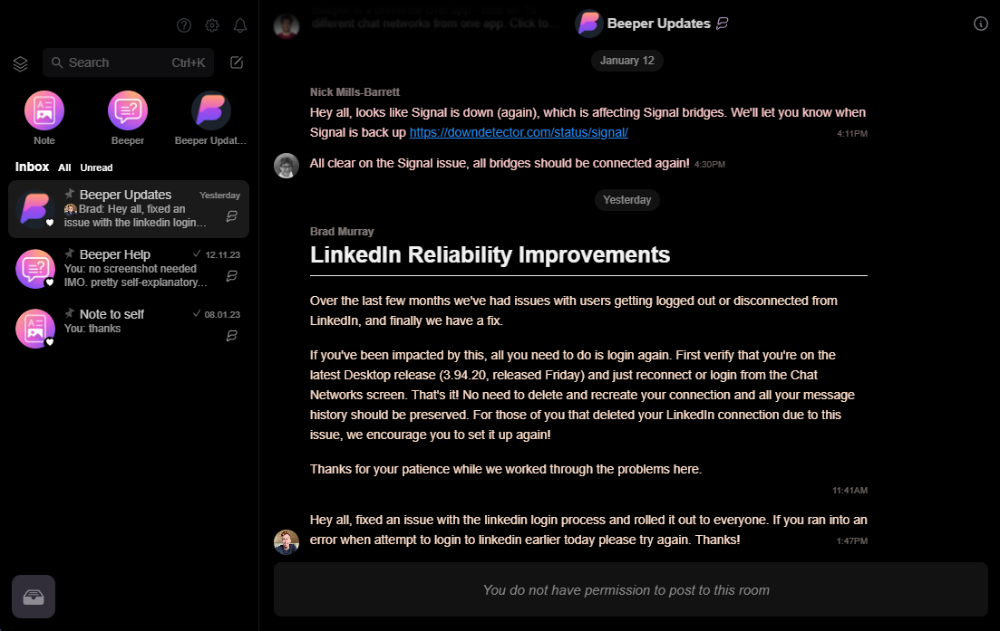

# pureblackjoesversion for beeper

an all black theme for [beeper](https://www.beeper.com/)

i love Chris McElroy's theme, [pureblack](https://github.com/Chris-McElroy/pureblack), but wanted a different font and a couple other small tweaks, figured id put my version up as well. 98% of credit goes to Chris.

Chris based his theme on the [metrology](https://github.com/Madelena/Metrology-for-Beeper/tree/main) theme.

# installation
1. copy the [the raw css code](https://github.com/jtchase08/pureblackjoesversion/blob/main/pureblackjoesversion.css)
2. paste it into the Custom CSS box at the bottom of Settings > Appearance
3. hit “Apply”
4. continue to hit “Apply” button each time the app restarts

# notes
- this theme does not change the settings panel, except for the font
- all themes reset when beeper restarts to avoid potential issues

# known issues
- Chris hasn't found a way to make the reply boxes for outgoing messages the same color as the reply boxes for incoming messages, and he would appreciate help. I'll be looking into this as well.
